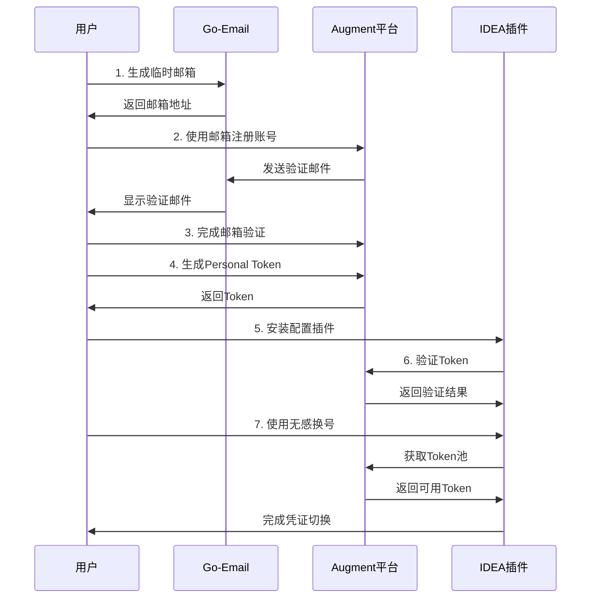

# 🌐 Augment 开发生态系统完整指南

## 📋 目录
- [🎯 生态系统概览](#-生态系统概览)
- [🚀 快速开始](#-快速开始)
- [📧 Go-Email 邮箱服务](#-go-email-邮箱服务)
- [🎯 Token池管理平台](#-token池管理平台)
- [🔧 IDEA插件使用](#-idea插件使用)
- [🔄 完整工作流程](#-完整工作流程)
- [💡 最佳实践](#-最佳实践)

---

## 🎯 生态系统概览

Augment 开发生态系统由三个核心组件构成，为开发者提供完整的 OAuth 凭证管理解决方案：

### 🏗️ 架构图

```
┌─────────────────┐    ┌─────────────────┐    ┌─────────────────┐
│   Go-Email      │    │   Token池       │    │   IDEA插件      │
│   邮箱服务      │───▶│   管理平台      │───▶│   无感换号      │
│                 │    │                 │    │                 │
│ 临时邮箱生成    │    │ Token池管理     │    │ 自动切换凭证    │
│ 验证码接收      │    │ 用户认证        │    │ 实时状态监控    │
│ 邮件转发        │    │ API服务         │    │ 图形化管理      │
└─────────────────┘    └─────────────────┘    └─────────────────┘
```

### 🔗 平台信息

| 组件 | 地址 | 主要功能 |
|------|------|----------|
| 📧 **Go-Email邮箱** | [gomail.184772.xyz](https://gomail.184772.xyz) | 临时邮箱、验证码接收 |
| 🎯 **Token池平台** | [augment.184772.xyz](https://augment.184772.xyz) | Token管理、用户认证 |
| 🔧 **IDEA插件** | GitHub Release | 无感换号、凭证管理 |

---

## 🚀 快速开始

### 第一步：获取临时邮箱

1. **访问邮箱服务**
   ```
   https://gomail.184772.xyz
   ```

2. **生成临时邮箱**
   - 点击"生成新邮箱"
   - 复制生成的邮箱地址
   - 保持页面打开以接收邮件

3. **邮箱功能**
   - ✅ 即时邮件接收
   - ✅ 验证码自动提取
   - ✅ 邮件转发功能
   - ✅ 多邮箱管理

### 第二步：注册Augment账号

1. **使用临时邮箱注册**
   - 前往Augment注册页面
   - 使用临时邮箱地址注册
   - 在邮箱服务中查收验证邮件

2. **完成邮箱验证**
   - 点击验证链接
   - 完成账号激活

### 第三步：配置Token池

1. **登录管理平台**
   ```
   https://augment.184772.xyz
   ```

2. **生成Personal Token**
   - 进入个人设置
   - 生成新的Personal Token
   - 复制并保存Token

### 第四步：安装IDEA插件

1. **下载插件**
   - 访问 [GitHub Releases](https://github.com/xn030523/augment-token-idea-free/releases)
   - 下载最新版本的 `token池-x.x.x.zip` 文件
---

## 📧 Go-Email 邮箱服务

### 🎯 核心功能

#### 📮 临时邮箱生成
- **一键生成**: 快速创建临时邮箱地址
- **自定义前缀**: 支持自定义邮箱前缀
- **多域名支持**: 提供多个域名选择
- **批量生成**: 支持批量创建多个邮箱

#### 📨 邮件管理
- **实时接收**: 邮件即时到达，无延迟
- **自动刷新**: 页面自动刷新显示新邮件
- **邮件预览**: 支持HTML和纯文本预览
- **附件下载**: 支持邮件附件下载

#### 🔍 智能功能
- **验证码提取**: 自动识别和提取验证码
- **关键词过滤**: 支持邮件内容关键词搜索
- **邮件转发**: 可转发重要邮件到真实邮箱
- **垃圾邮件过滤**: 自动过滤垃圾邮件

### 💡 使用技巧

1. **注册多个服务**
   - 为不同服务使用不同的临时邮箱
   - 避免邮箱地址冲突

2. **验证码快速获取**
   - 保持邮箱页面打开
   - 使用自动刷新功能
   - 关注验证码提取提示

3. **重要邮件保存**
   - 及时转发重要邮件
   - 截图保存关键信息

---

## 🎯 Token池管理平台

### 🏠 平台概览

Token池管理平台是整个生态系统的核心，提供：

#### 👤 用户管理
- **账号注册**: 支持邮箱注册和验证
- **个人资料**: 完善的用户信息管理
- **安全设置**: 密码修改、二次验证等

#### 🔐 Token管理
- **Personal Token**: 生成和管理个人访问令牌
- **Token池**: 管理共享Token池
- **权限控制**: 细粒度的权限管理
- **使用统计**: 详细的使用情况统计

#### 📊 监控面板
- **实时状态**: Token使用状态实时监控
- **使用统计**: 详细的使用数据分析
- **性能指标**: API调用性能监控
- **告警通知**: 异常情况及时通知


---

## 🔧 IDEA插件使用

### 🎯 主要功能

#### 🔐 Personal Token管理
- **Token验证**: 验证Personal Token有效性
- **自动保存**: 安全存储Token信息
- **状态监控**: 实时监控Token状态

#### 🎯 无感换号
- **智能选择**: 自动选择最优可用Token
- **负载均衡**: 基于使用次数的智能分配
- **故障转移**: 自动切换到可用凭证

#### ⚙️ 凭证管理
- **Session ID**: 实时修改Session ID
- **免重启更新**: 动态更新凭证
- **批量操作**: 支持批量凭证管理

### 🎨 界面操作

#### 设置界面
```
File → Settings → Tools → Token池
```

#### 主要操作
1. **输入Personal Token**: 在设置界面输入Token
2. **验证Token**: 点击验证按钮确认有效性
3. **无感换号**: 使用一键换号功能
4. **查看状态**: 实时查看Token池状态

---

## 🔄 完整工作流程

### 📋 新用户流程



### 🔄 日常使用流程

1. **启动开发环境**
   - 打开IDEA
   - 插件自动检查Token状态

2. **自动凭证管理**
   - 插件智能选择最优Token
   - 自动处理Token过期情况

3. **无感切换**
   - 遇到Token问题自动切换
   - 无需手动干预

---

## 💡 最佳实践

### 🔒 安全建议

1. **Token安全**
   - 定期更换Personal Token
   - 不要在代码中硬编码Token
   - 使用安全的存储方式

2. **邮箱安全**
   - 及时清理临时邮箱
   - 不要用于重要服务注册
   - 注意隐私保护

3. **账号安全**
   - 使用强密码
   - 启用二次验证
   - 定期检查登录记录

### ⚡ 性能优化

1. **Token使用**
   - 合理使用无感换号功能
   - 避免频繁切换Token
   - 监控Token使用情况

2. **插件配置**
   - 定期更新插件版本
   - 清理无效配置
   - 优化设置参数

### 🛠️ 故障排除

#### 常见问题

1. **Token验证失败**
   - 检查Token是否正确
   - 确认网络连接正常
   - 验证平台服务状态

2. **邮箱收不到邮件**
   - 刷新邮箱页面
   - 检查垃圾邮件过滤
   - 尝试重新生成邮箱

3. **插件无法连接**
   - 检查网络设置
   - 确认API地址正确
   - 查看插件日志

#### 获取帮助

- **QQ技术群**: 1017212982
- **GitHub Issues**: [提交问题](https://github.com/xn030523/augment-token-idea-free/issues)
- **在线文档**: 查看详细文档

---

## 🎉 总结

Augment 开发生态系统为开发者提供了完整的 OAuth 凭证管理解决方案：

- 📧 **Go-Email**: 解决邮箱验证问题
- 🎯 **Token池平台**: 提供集中化Token管理
- 🔧 **IDEA插件**: 实现无感的开发体验

通过三个组件的完美配合，开发者可以享受到：
- ✅ 无缝的凭证管理体验
- ✅ 自动化的Token切换
- ✅ 安全可靠的服务保障
- ✅ 完善的技术支持

立即开始使用，提升您的开发效率！
